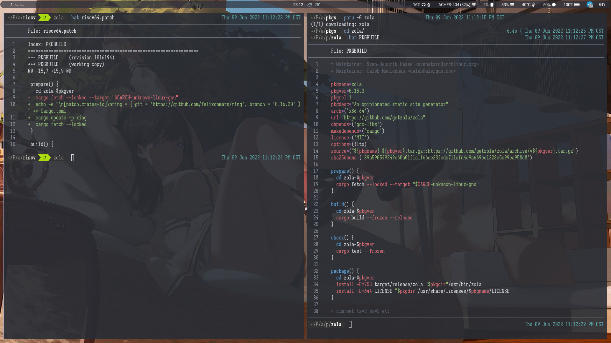

# 快速上手

- [快速上手](#快速上手)
  - [简介](#简介)
  - [获取 PKGBUILD](#获取-pkgbuild)
    - [Git 或 Web](#git-或-web)
    - [asp](#asp)
    - [AUR Helper](#aur-helper)
  - [打上 Patch 🎇](#打上-patch-)

## 简介

> 同学，你听说过 Arch Linux 吗？

可能你没用过 Arch Linux，但或多或少也听说，甚至体验过过 AUR。用户提交一个构建包的描述文件 —— PKGBUILD，通过 AUR 平台分发这个文件，其他用户就可以在自己的设备上自动构建所需要的包。

Arch RISCV 的打包方式与常规的 Arch 打包方式略有不同，与其说是在打包，不如说是在原有的 PKGBUILD 上打补丁，通过 patch 的方式把这个 PKGBUILD 修改成自己需要的样子。之所以没像 Arch Linux ARM 那样完全独立出去，是因为希望有朝一日能得到 Arch Linux 官方架构支持。



如上图所示是一个 `Rust` 语言开发的静态博客生成工具 `zola`（看不清可以右键新建标签页中打开），右边是原始的 Arch Linux PKGBUILD，而左边是我们为了能在 RISCV 架构上顺利打出这个包所做的一点 “修补”。 

可以看到这个补丁移除了原有 PKGBUILD 指定编译到目标架构 `$CARCH` 的部分内容。 [`$CARCH`](https://wiki.archlinux.org/title/PKGBUILD#arch) 相关内容在 Arch Wiki 中有提及，这里不作赘述。

可以看到这个包很有意思的地方在于直接替换了 `ring` 这个依赖库的上游。对于一些密码学相关的库，若只是平时使用到不会觉得有太多不同，但对于实际开发和编译来说，会牵扯到很多架构上特有的问题，从打包变到针对架构开发也成了自然而然的事情，这里也感谢肥猫的卓越贡献。

## 获取 PKGBUILD

### Git 或 Web

记得小的时候还用过一个名为世界之窗的浏览器，浏览器作为沟通网络世界的窗户，自然是能够直接获取到 PKGBUILD 原始文件的。

Arch Linux 已经完成了从 SVN 到 Git 的迁移，现在所有官方软件包的构建文件都能在 [https://github.com/archlinux/svntogit-community/](https://github.com/archlinux/svntogit-community/) 仓库中找到。

但是 Github 提供的搜索功能较为有限，也可以通过 [https://archlinux.org/packages/](https://archlinux.org/packages/) 页面找到所需要的包，然后右上角 `Package Actions > Source Files` 转跳到目的链接。

### asp

除此之外，Arch 开发者在以前 SVN 的时代为了方便同步构建源代码，还开发了名为 `asp` 的构建资源管理工具。

`$ sudo pacman -S asp` 即可快速安装。

获取软件包命令如下：

```bash
$ asp checkout <package name>

.
├── repos
│   └── community-x86_64
│       └── PKGBUILD
└── trunk
    └── PKGBUILD
```

可以看到还是保留了 SVN 的目录结构，`trunk` 即为主线，对应 git 上的 `main` 或者 `master`，`repos` 内是对应软件源分支，一个软件可能同时存在稳定版和测试版两种软件包状态，那么在这里的 `repos` 中就会多一个分支，我们在打包时候按需选取即可。

### AUR Helper

AUR Helper 从来都不是特指某一个工具，而是某一类能帮你从 AUR 上拉去构建资源文件的工具，并且自动帮你完成构建。比如早期的 `yaourt`，现在比较流行的 `paru` 和 `yay` 等。很高兴它们都提供了下载官方软件包资源的功能，为我们的使用提供了方便。

```bash
$ paru -G <package name>
$ yay -G <package name>
```

使用更加方便，没有复杂的目录结构，只有单纯的文件，如果需要来自不同软件源的则需要在拉取的时候带上软件源名称，比如 `community/zola`。

## 打上 Patch 🎇